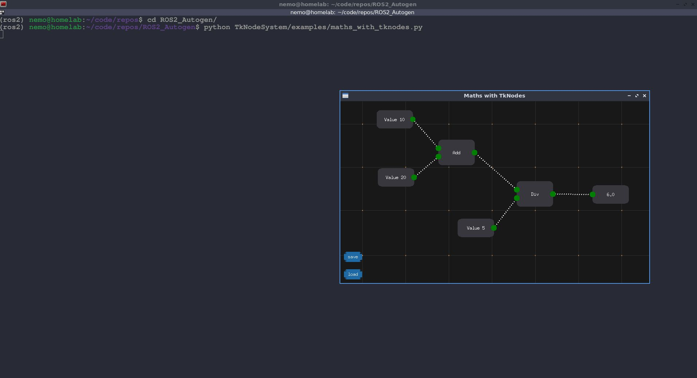

# Tkinter based Node system

## setup

```
cd ROS2_Autogen
pip install -r requirements.txt
```

## usage

### simple math nodes example
```
python TkNodeSystem/examples/maths_with_tknodes.py
```
Initially, will be a blank screen. To load the example shown in the screenshot, click 'load' and it will open up the example, the metadata for which is stored in 'canvas.json'.

Alternatively, to add your own nodes, press 'space' to open up the menu which allows you to add the basic math nodes.

#### preview



### 3d viewer example
```
python TkNodeSystem/examples/advanced_example.py
```

## dev notes

### [06.02.2024]

- Work in progress, right now these are only example scripts from public repositories. Need to modify for our use case.
    - refs:
        - [github: Akascape / TkNodeSystem](https://github.com/Akascape/TkNodeSystem)
        - [github gist for ros sub in tkinter](https://gist.github.com/jones2126/a397b502923472f13c4529e2c9abd6c3)

- replace basic node as base template for ros flow based workflow
- check ./scripts/ros_topic_tkinter.py for basic example of a ros subscriber in tkinter
- added Tknodesystem github repository as submodule

